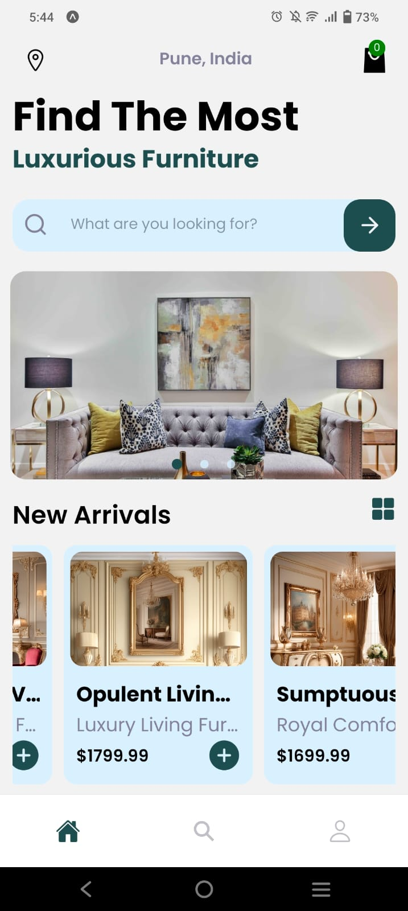
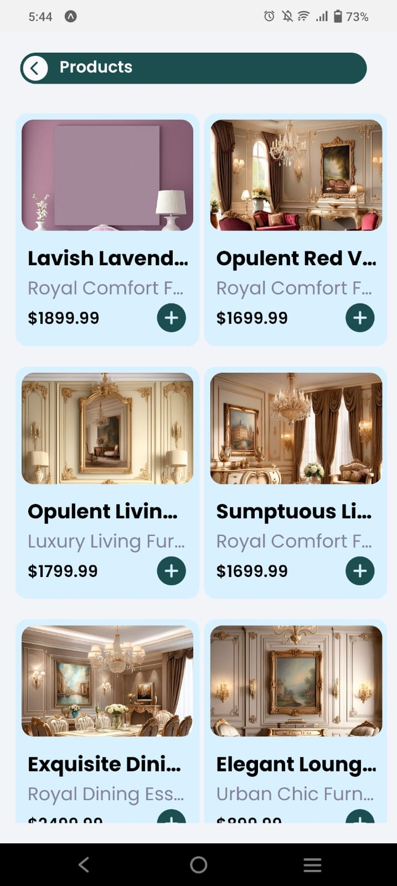
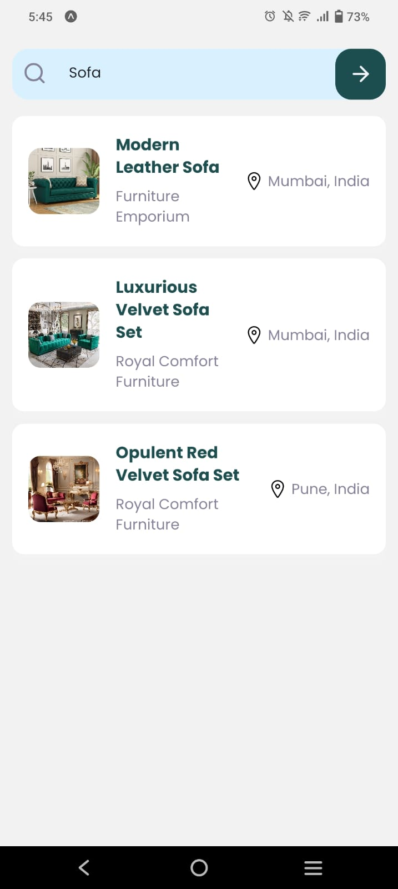
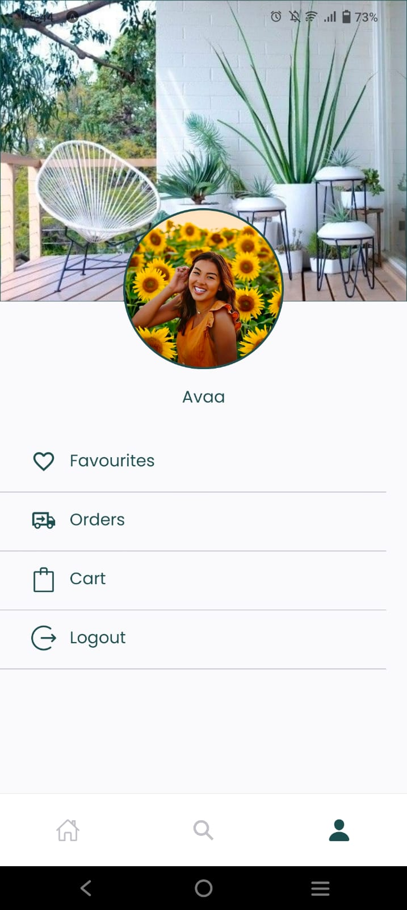
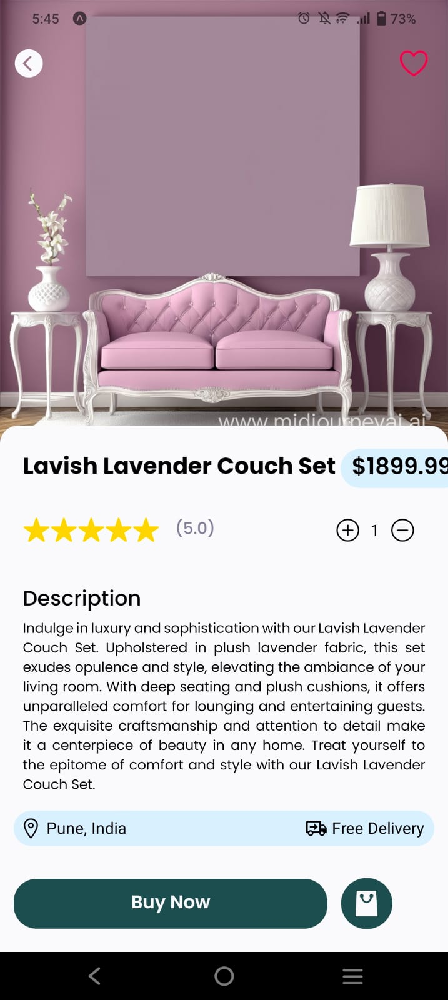
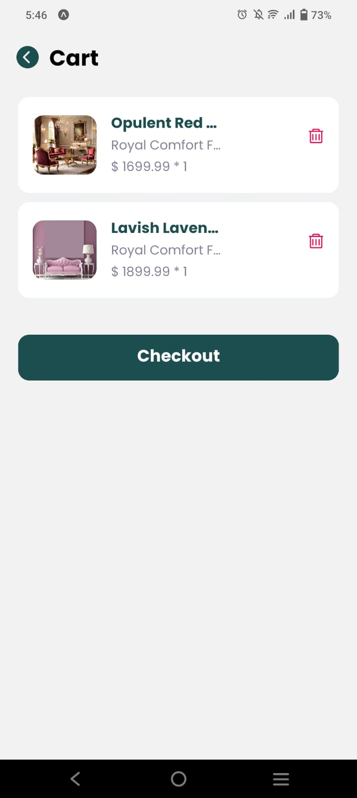
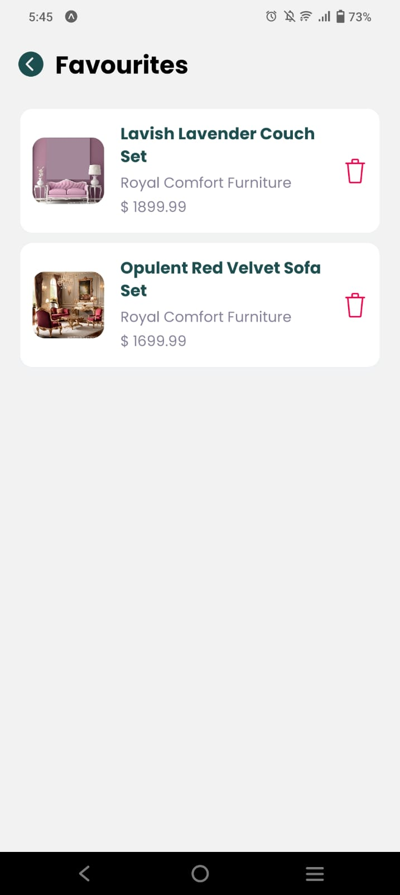
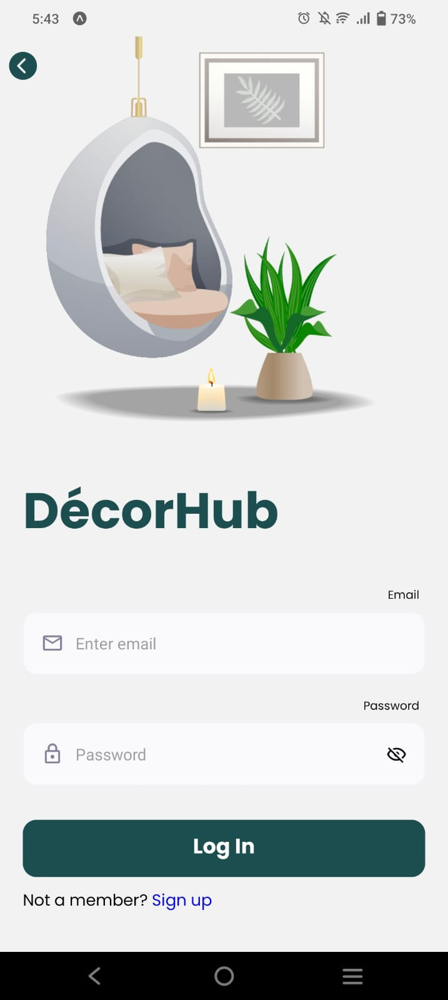

# DécorHub


## Tech Stack

- JavaScript
- React Native
- Expo Router
- Formik and Yup
- React Query
- Axios
- Express
- Mongo DB
- Stripe (Payment processor)

## Run Locally

Clone the project

```bash
git clone https://github.com/adityaxp/DecorHub.git
```

Install Dependencies

```bash
npm install or yarn install 
```


Start  App

```bash
npm start or npx expo start
```

## App screenshots

           
            
                             
